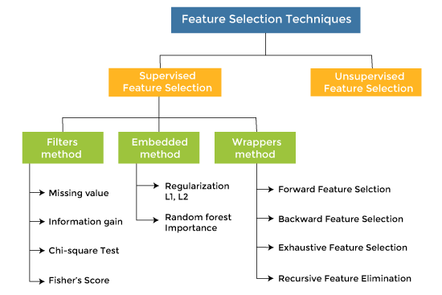
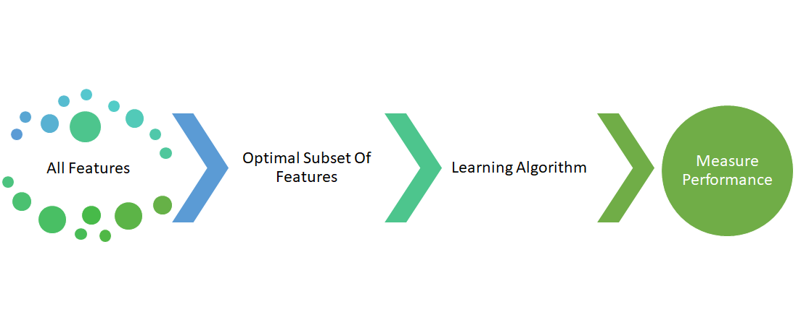
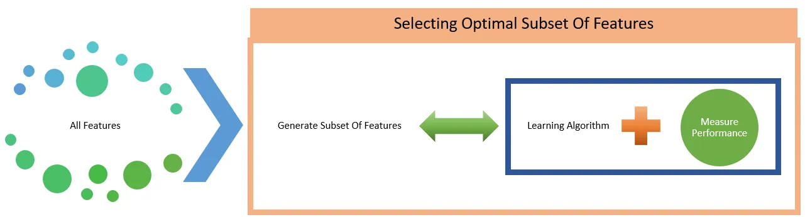
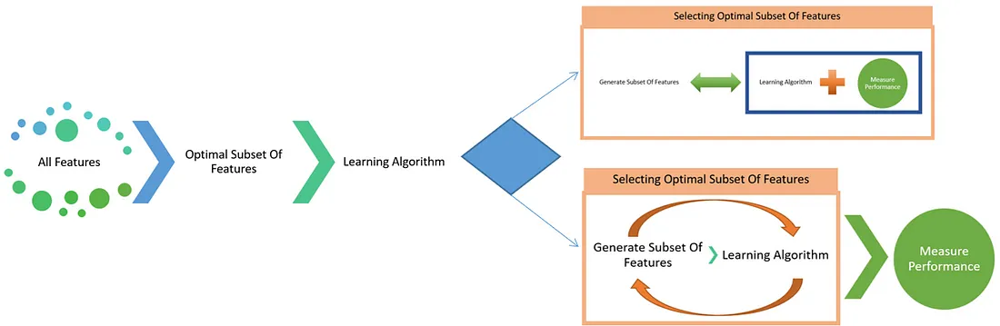
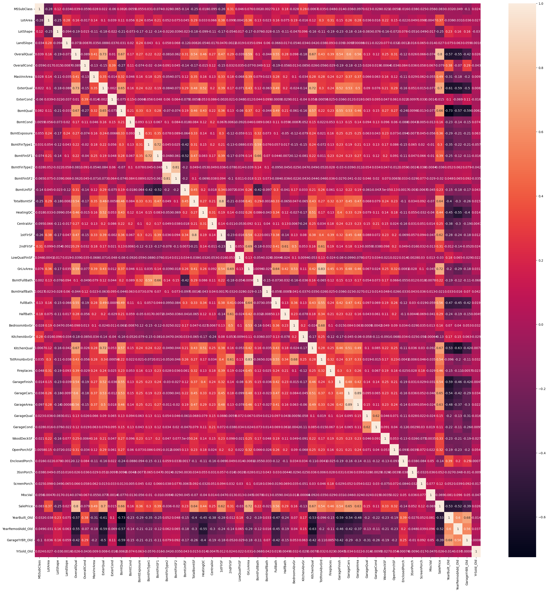

# Group 3: Feature Selection

## Abstract:
This is the repository for the feature selection project, a class assignment where the authors presented a brief report on Feature selection methods in machine learning.  Feature selection is  a crucial pre-processing technique in machine learning. It encompasses dimensionality techniques  used to select relevant features and remove redundant ones. It has shown several benefits, such : preventing overfitting, dimensionality reduction, increassing the learning process and the accuracy of models. Feature selection methods are discussed, challenges and good practices provided, and a case study on the LASSO method concludes the report

## Feature selections(FS):
The FS methods can be categorized in three: supervised, unsupervised, and semi-supervised. They all 3 depend on the learning task being solved.

 Feature Selection classess. Credit: <a href=" https://i0.wp.com/blog.knoldus.com/wp-content/uploads/2022/02/feature-selection-techniques-in-machine-learning2.png?resize=550%2C367&ssl=1 ">Tanishka Garg  </a>

## Feature Selection Methods:

### Filter Methods
Filter methods are feature selection techniques that are independent of any learning algorithms
i.e. model-agnostic. They assess feature importance based on statistical properties or relationships
between features and the target variable. Typically, these methods rank features according to criteria
such as correlation, statistical significance, and information gain, filtering out low-ranking features
and retaining the most relevant ones. 

 Filter method pipeline in the learning process. Credit: <a href="https://towardsdatascience.com/beginners-guide-for-feature-selection-by-a-beginner-cd2158c5c36a">Tamjid Ahsan </a> in Towards Data Science. 

## Wrapper Methods
Wrapper methods are a class of feature selection techniques that evaluate and select features based on85
a machine learning model’s performance. In contrast to filter methods, which operate independently86
of the model, wrappers involve training and evaluating the model multiple times with different87
subsets of features to identify the subset that yields the highest prediction performance. Initially, the88
model’s performance is measured using specific subsets of the dataset to determine the significance89
of each feature. This process continues with different subsets until the one with the highest learning90
performance is determined

 Wrapper method pipeline in the learning process. Credit: <a href="https://towardsdatascience.com/beginners-guide-for-feature-selection-by-a-beginner-cd2158c5c36a">Tamjid Ahsan </a> in Towards Data Science. 

## Embedded Methods
 Embedded methods are iterative in the sense that takes care of each iteration of the model training process and carefully extract those features which contribute the most to the training for a particular iteration. It encompass the benefits of both the wrapper and filter methods by including interactions of features but also maintaining reasonable computational costs. These methods are faster like those of filter methods and more accurate than the filter methods and take into consideration a combination of features as well. Embedded methods are  also computationally less intensive, less prone to overfitting, and have faster running time as compared with wrappers. Lasso and Ridge regression are the two most common feature selection methods of this type, and Decision tree also creates a model using different types of feature selection. The tree-based classification algorithms, such as Classification and Regression Trees (CART) and Iterative Dichotomiser 3 (ID3) are examples of embedded methods.
 
 
 Embedded method pipeline in the learning process. Credit: <a href="https://towardsdatascience.com/beginners-guide-for-feature-selection-by-a-beginner-cd2158c5c36a">Tamjid Ahsan </a> in Towards Data Science. 

 ## Hybrid Methods
The general idea behind hybrid methods is to combine different feature selection approaches and leverage the strengths of selectors to achieve the best, i.e., optimal, results. For instance, a hybrid method can be constructed by combining filter and wrapper methods. The feature selection process works as follows. First, the entire feature set is ranked by a filter method. Then, the user generates a feature subset usually by heuristically setting a relevance threshold or by simply selecting the top n features. Finally, a wrapper method is employed to further reduce the generated feature subset. The main issue in hybrid methods is the successive use of different feature selection methods increases the computational cost.
 
 
 Embedded method pipeline in the learning process. Credit: <a href="https://towardsdatascience.com/beginners-guide-for-feature-selection-by-a-beginner-cd2158c5c36a">Tamjid Ahsan </a> in Towards Data Science. 

## Challenges in Feature Selection
Feature selection is a crucial step in machine learning that offers many benefits, but it also comes with challenges. One of them is dealing with redundant features, which can occur when features are similar or correlated, leading to multicollinearity. This can negatively impact the model's performance and interpretability.

According to [10], most feature selection methods address the dependency problem but often fail to ensure the optimality of the feature subset. Efficient feature selection must balance relevance and redundancy removal, which requires careful evaluation and validation.
Moreover, several other challenges complicate the feature selection process and are specially data-based:

## Feature selection using the Least Absolute Shrinkage and Selection Operator (LASSO)
In the following lines we describe the LASSO method for linear models before using it for feature selection the next section.

Assume that the learning task is to predict a variable $Y$ from $p$ other features $X_1, \ldots, X_p$, given the dataset $\mathcal{D}=(X_i, y_i), i=1, \ldots, n\}$. Roughly speaking, let's assume $\fm D$ is given and 
\begin{align}

## LASSO formulation
Considering eq. \ref{eq1}, the LASSO is formulated as the problem consists of finding $\hat{\beta}(t)$ such that
\begin{align}
    \hat{\beta}(t) = \underset{\beta\in \mathbb{R}^{p\times 1}}{argmin} \left(\frac{\Vert Y-\b X \beta \Vert^2_2}{n}\right)\;\; \text{ constrained to } \;\sum_{j=1}^p \vert \beta_j\vert < t \label{eq3}
\end{align}
with $\Vert \cdot \Vert_2$ the euclidean norm of $\mathbb{R}^n$ and $t$ an upper bound for the sum of coefficients. This problem is equivalent to writing
\begin{align}
    \hat{\beta}(\lambda) = \underset{\beta\in \mathbb{R}^{p\times 1}}{argmin} \left(\frac{\Vert Y-\b X \beta \Vert^2_2}{n} + \lambda \sum_{j=1}^p \vert \beta_j\vert\right) \label{eq4}
\end{align}
with $\lambda \geq 0$ is a tuning parameter that balances the model fit and the shrinkage.

## Case study:
In this section we showcase the implementation of the LASSO as a feature selection method  on a real dataset.  
### Dataser and model.
The dataset used for this case-study is downloaded from \href{https://www.kaggle.com/code/sid9300/assignment-surprise-housing-l-r}{kaggle}, it has $70$ features and 1441 observations.  The problem of concern is to predict house prices in Australia. Formally, the response feature is \textit{house price} against the $69$ input features. For instance, the aim is to understand the factors, like \textit{the house's age, the zone where house is located, the roof materials}, etc., influence the price of the house.  Here are the steps followed:
 - Explore the dataset and compute the correlation between them, see fig. \label{fig1}.
- We use one-hot encoding for categorical dataset on the categorical features, such as \textit{MSZoning, Neighborhood, and HouseStyle}, since the output is continuous and  the regression model used requires continuous inputs.  This process entails to increase the number of features to $191$ features.
- feature scaling step was performed. By performing feature scaling, the dataset is transformed into a more suitable format for training a regression model, which can lead to improved model performance, stability, and interpretability.
  - Apply Recursive Feature Elimination.  This is used to reduce the eliminate irrelevant features obtained after one-hot encoding.
- We use  GridSearch and K-Fold cross vaildation to obtain the best value for $\alpha$, the penality term in the LASSO, refer to fig. \ref{fig1}.
-  We fit the model and apply the LASSO. It results $45$ features selected. 

## How to use this repo:

## References

